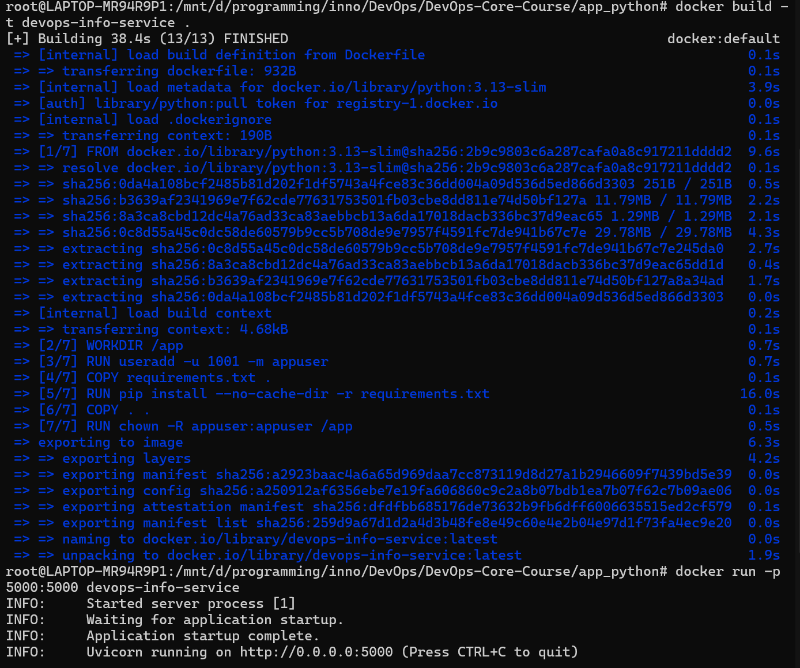
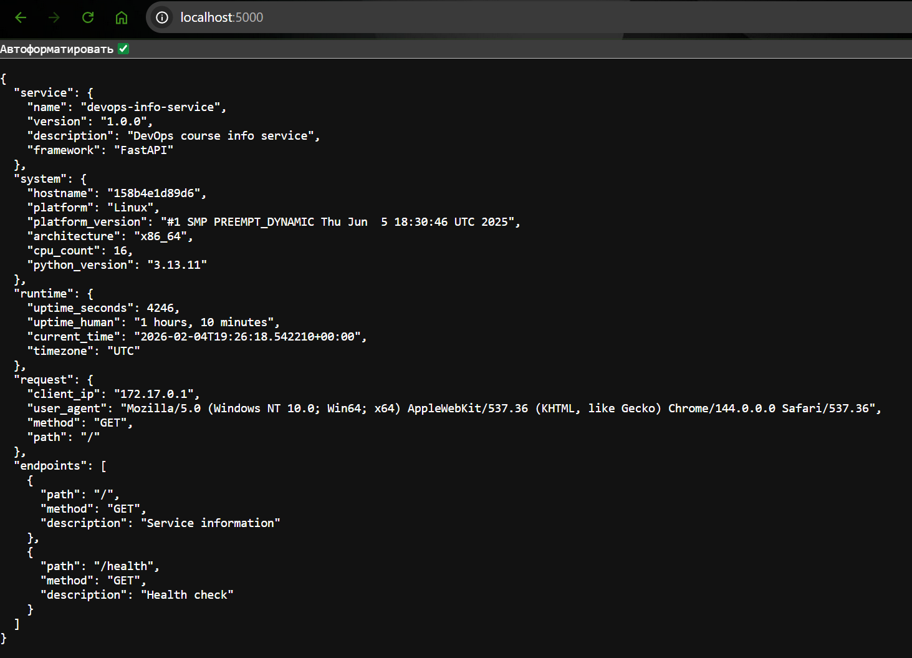

# Lab 2: Docker Containerization

**Student**: Selivanov George  
**Date**: February 04, 2026  

## 1. Docker Best Practices Applied

The following best practices were implemented in the `Dockerfile` to ensure security, efficiency, and maintainability:

### 1.1 Non-Root User
**Practice:** Created a dedicated user (`appuser`) and switched to it using the `USER` directive.
**Why:** Running containers as root is a major security risk. If an attacker limits the container scope, they still potential access to the host as root. A non-root user limits the potential blast radius of a security compromise.
```dockerfile
RUN useradd -u 1001 -m appuser
...
USER appuser
```

### 1.2 Layer Caching & Ordering
**Practice:** Copied `requirements.txt` and installed dependencies *before* copying the source code.
**Why:** Docker caches layers. Dependencies change infrequently, while code changes often. By separating these steps, rebuilds are significantly faster because the expensive `pip install` step is cached and reused unless `requirements.txt` changes.
```dockerfile
COPY requirements.txt .
RUN pip install --no-cache-dir -r requirements.txt
COPY . .
```

### 1.3 Minimal Base Image
**Practice:** Used `python:3.13-slim` instead of the full `python:3.13` image.
**Why:** The slim image contains only the minimal packages needed to run Python, significantly reducing the image size (approx. 100-200MB vs 1GB) and reducing the surface area for security vulnerabilities.

### 1.4 .dockerignore
**Practice:** Used a `.dockerignore` file to exclude `__pycache__`, `.git`, `venv`, and other unnecessary files.
**Why:** Prevents large and unnecessary files from being sent to the Docker daemon build context. This speeds up the build process and prevents including sensitive files (like local secrets or git history) in the final image.

### 1.5 No Cache for Pip
**Practice:** Used `pip install --no-cache-dir`.
**Why:** Prevents pip from storing the downloaded package files, which are not needed after installation, further reducing the image size.

## 2. Image Information & Decisions

| Attribute | Value | Justification |
|-----------|-------|---------------|
| **Base Image** | `python:3.13-slim` | Provides a balance between size and compatibility. Alpine images can sometimes have compatibility issues with Python C-extensions (wheels), while `slim` is Debian-based and more standard for Python. |
| **User** | `appuser` (UID 1001) | Standard practice to use a high UID to avoid conflict with host users. |
| **Port** | 5000 | Match the default Flask/FastAPI port configuration. |

**Optimization Choices:**
- **Ordering:** Put `requirements.txt` copy/install before app copy to maximize cache hits.
- **Cleanup:** Using `--no-cache-dir` to keep layers small.

## 3. Build & Run Process

### 3.1 Build & Run Container
```bash
docker build -t ge0s1/devops-lab2 .
docker run -d -p 5000:5000 --name devops-lab2-container ge0s1/devops-lab2
```

**Terminal Output (Success):**


### 3.3 Test Endpoints
```bash
http://localhost:5000/
```

**Output:**


### 3.4 Docker Hub
**User:** `ge0s1`
**Repository:** [https://hub.docker.com/r/ge0s1/devops-lab2](https://hub.docker.com/r/ge0s1/devops-lab2)

**Push Commands:**
```bash
docker login
docker tag devops-info-service ge0s1/devops-info-service:v1.0.0
docker push ge0s1/devops-info-service:v1.0.0
```

## 4. Technical Analysis

The detailed `Dockerfile` construction ensures that:
1.  **Security is prioritized**: The application does not run as root. This isolates the process. If a vulnerability allows an attacker to break out of the Python process, they will still be a low-privileged user inside the container, and even if they escape the container (which is hard), they won't automatically be root on the host.
2.  **Build speed is optimized**: By carefully ordering the `COPY` commands, we ensure that changing a line of code in `app.py` doesn't trigger a re-download and re-install of all PyPI packages. Docker simply reuses the cached layer for dependencies.
3.  **Context is clean**: The `.dockerignore` file ensures that local development artifacts like `__pycache__` or the virtual environment folder are not copied into the image. This prevents pollution of the container environment and ensures the container relies ONLY on `requirements.txt` for dependencies, making it reproducible.